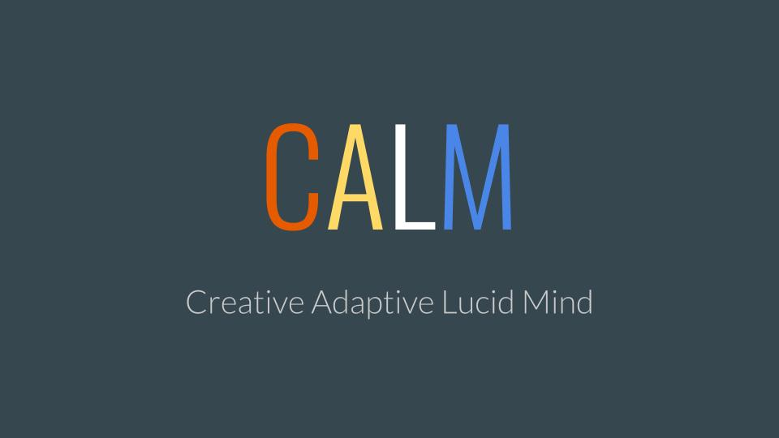

# Make America Human Again

> "It's just a matter of time before 100% of our jobs today are replaced by machines."
  ~ John Hagel
  
> "Knowledge Economy as we know it is being eclipsed by something new -- call it the Creative Economy."
  ~ Bruce Nussbaum

Machines are beginning to take over the workforce. Merely acquiring, practicing, and applying many new skills and knowledge will no longer be enough. We need to develop the qualities that make us uniquely human, such as creativity, imagination, and curiosity. Cognitive fluidity is the golden braid that connects these qualities. ***CALM provides various research-backed tools to develop and exercise cognitive fluidity.***
&nbsp;

------
# Chapters
#### Each chapter has two components: tracks and projects.
### Chapter Tracks
Each chapter of CALM has either a TED-Ed Club or a Founders Labs (or both!). Members get access to a real-world setting in which they create, develop, execute, and convey their ideas.
### Projects
Each chapter has an approved project in which the chapter devises and executes a method to improve the cognitive fluidity of community members. 
### Chapters
#### Fremont High School
#### Lawson Middle School
&nbsp;

------
# Independent projects
Members of CALM may submit independent projects that are proven by research to develop cognitive fluidity. Projects are published in CALM’s journal, and are eligible for awards and aid.
&nbsp;

------
# Join today!
<form action="mailto:svasu407@student.fuhsd.org" method="post" enctype="text/plain">
Name: 
<input type="text" name="name"> 
E-mail: 
<input type="text" name="mail"> 
School: 
<input type="text" name="school"> 
Grade: 
<input type="text" name="grade"> 
Comment: 
<input type="text" name="comment" size="50">  
<input type="submit" value="Send">
<input type="reset" value="Reset">
</form>
&nbsp;

This is Creative Adaptive Lucid Mind's new website. Here is the [old website](https://samhitavasu.github.io/gocalm.github.io).
