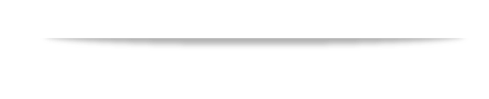

<h1 style="text-align: center;" markdown="1"> [Watch Highlights](https://youtu.be/-MYcJZLB7rE?t=192) </h1> 
&nbsp;

# Make America Human Again.
> "It's just a matter of time before 100% of our jobs today are replaced by machines."
  ~ John Hagel
  
> "Knowledge Economy as we know it is being eclipsed by something new -- call it the Creative Economy."
  ~ Bruce Nussbaum

Machines are beginning to take over the workforce. Merely acquiring, practicing, and applying many new skills and knowledge will no longer be enough. We need to develop the qualities that make us uniquely human, such as creativity, imagination, and curiosity. Cognitive fluidity is the golden braid that connects these qualities. ***CALM provides various research-backed tools to develop and exercise cognitive fluidity.***
&nbsp;

-------
# Components
### TED-Ed Clubs
### Founders Lab
Selected projects will get access to CALM's Board of Mentors, comprising of successful entrepreneurs and professionals from the Silicon Valley.
<a href="mailto:svasu407@student.fuhsd.org"> Learn more about submitting a project proposal today!</a>
### Chapter Projects
Members of CALM may submit independent projects that are proven by research to develop cognitive fluidity. 
&nbsp;

-------
# Join today!
<!-- <form action="mailto:svasu407@student.fuhsd.org" method="post" enctype="text/plain">
Name: 
<input type="text" name="name"> 
E-mail: 
<input type="text" name="mail"> 
School: 
<input type="text" name="school"> 
Grade: 
<input type="text" name="grade"> 
Comment: 
<input type="text" name="comment" size="50">  
<input type="submit" value="Send">
<input type="reset" value="Reset">
</form> -->
Email Samhita Vasu: <a href="mailto:svasu407@student.fuhsd.org">svasu407@student.fuhsd.org</a>
&nbsp;
&nbsp;
<!-- This is Creative Adaptive Lucid Mind's new website. Here is the [old website](https://samhitavasu.github.io/gocalm.github.io). -->
